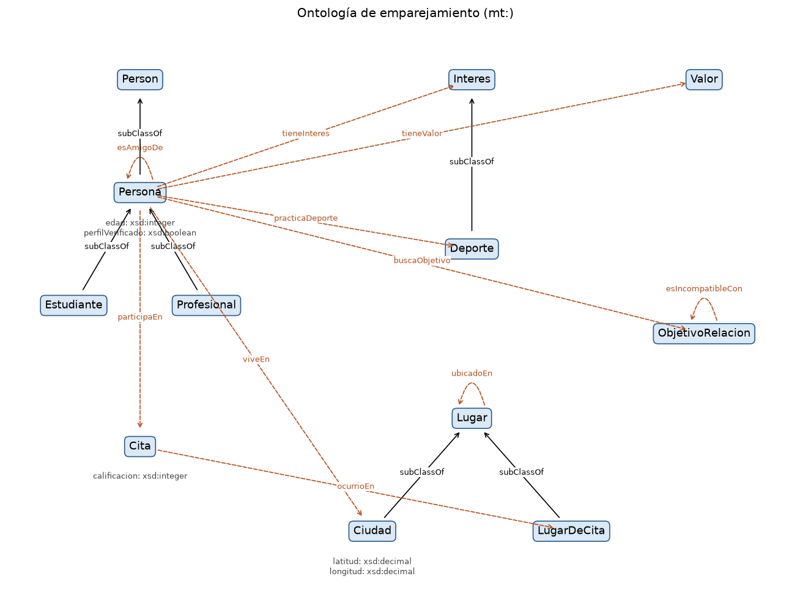
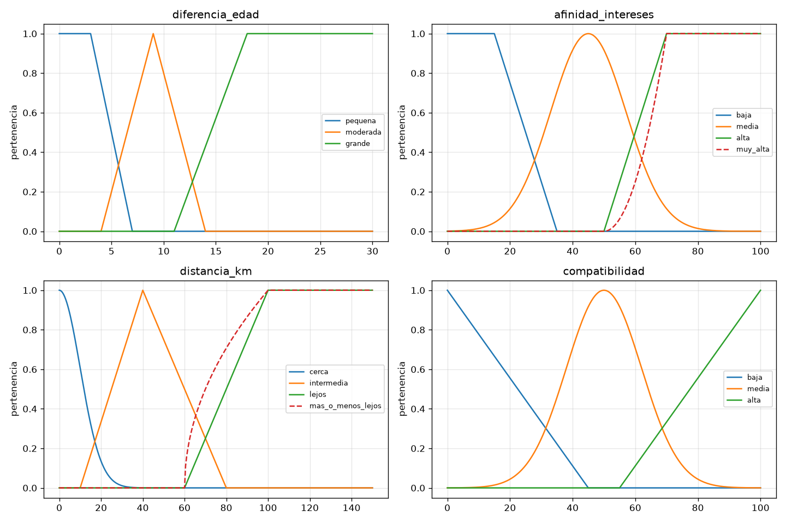

# Práctica 1 – Sistema híbrido de emparejamiento interpersonal

**Introducción a la Inteligencia Artificial (3010476) – Universidad Nacional de Colombia, Sede Medellín**
**Grupo:** XX  **Equipo:** YY
**Integrantes:** _(completar)_
**Video de sustentación (YouTube):** _(pegar enlace)_

---

## 1. Problema y alcance

El sistema recibe una comunidad de personas con su perfil (edad, ciudad, intereses, deportes, valores, tipo de relación que buscan, amigos y citas pasadas) y decide para **cada par de personas** qué acción conviene:

| Acción | Significado |
|---|---|
| `proponer_cita` | alta compatibilidad; además se sugiere un lugar (`sugerir_lugar`) |
| `sugerir_conversar` | compatibilidad aceptable, conviene que se conozcan primero |
| `pedir_verificacion` | buena compatibilidad pero alguno no tiene el perfil verificado |
| `descartar` | objetivos incompatibles, mala cita previa o compatibilidad baja |
| `revisar_manual` | ninguna regla de decisión aplicó |

Cada paradigma resuelve una parte distinta:

- **Ontología (RDF/RDFS + OWL-RL):** qué existe y cómo se relaciona; el razonador deduce hechos que no están escritos (por ejemplo, que Sofía también es Persona).
- **Lógica difusa (Scikit-Fuzzy):** variables graduales (diferencia de edad, afinidad, distancia) donde no hay un corte exacto.
- **Sistema experto (Experta):** toma la decisión con reglas SI–ENTONCES que combinan los hechos de la ontología y el resultado difuso.

No se modelan género, orientación ni datos sensibles.

## 2. Arquitectura y flujo

```
ontologia/emparejamiento.ttl
        │  cargar_y_razonar()  → DeductiveClosure(RDFS_Semantics)
        ▼
grafo inferido (+ grafo original para marcar lo inferido)
        │  traducir()  → Individuo / Relacion / Propiedad / Esquema
        ▼
hechos del sistema experto
        │  calcular_pares()  → edad_diff, afinidad, distancia → calcular_compatibilidad()
        ▼
Facts AfinidadDifusa (uno por par)
        │
        ▼
MotorEmparejamiento (Experta) → Recomendacion + Evaluado
```

| Carpeta / archivo | Contenido |
|---|---|
| `vocab.py` | constantes con los URIs del dominio (las usan las reglas, no el traductor) |
| `ontologia/` | `emparejamiento.ttl`, `razonamiento.py`, `diagrama.py` |
| `difuso/` | `variables.py`, `reglas.py`, `api.py`, `graficas.py` |
| `experto/` | `hechos.py`, `reglas.py`, `motor.py` |
| `integracion/` | `traductor.py`, `preparar_difuso.py` |
| `main.py` | orquesta todo el flujo |
| `practica1_emparejamiento.ipynb` | notebook de Colab con todos los módulos |

## 3. Módulo de ontología

### 3.1 Clases y jerarquía

Namespace `mt: <http://ejemplo.org/emparejamiento#>`, serializada en Turtle. Todas las clases y propiedades tienen `rdfs:label`.

| Clase | Superclase | Individuos (4) |
|---|---|---|
| `mt:Persona` | `foaf:Person` | Laura, Carlos, Diana, Julián |
| `mt:Estudiante` | `mt:Persona` | Sofía, Tomás, Isabela, Samuel |
| `mt:Profesional` | `mt:Persona` | Andrés, Mateo, Paula, Daniel |
| `mt:Interes` | – | Cine, Lectura, Música, Viajar |
| `mt:Deporte` | `mt:Interes` | Fútbol, Running, Ciclismo, Natación |
| `mt:Valor` | – | Honestidad, Familia, Aventura, Ambición |
| `mt:ObjetivoRelacion` | – | Amistad, RelacionCasual, RelacionSeria, Matrimonio |
| `mt:Lugar` | – | Antioquia, AreaMetropolitana, OrienteAntioqueno, EjeCafetero |
| `mt:Ciudad` | `mt:Lugar` | Medellín, Envigado, Rionegro, Manizales |
| `mt:LugarDeCita` | `mt:Lugar` | JardinBotanico, ParqueExplora, ParqueLleras, CafeCentral |
| `mt:Cita` | – | cita1 … cita4 |

11 clases y 6 relaciones `rdfs:subClassOf`. Además `mt:Camila` se declaró **sin** `rdf:type` para el caso 2 de inferencia.

### 3.2 Propiedades (15 propias)

| Propiedad | Dominio | Rango | Nota |
|---|---|---|---|
| `tieneInteres` | Persona | Interes | |
| `practicaDeporte` | Persona | Deporte | `subPropertyOf tieneInteres` |
| `tieneValor` | Persona | Valor | |
| `buscaObjetivo` | Persona | ObjetivoRelacion | |
| `esIncompatibleCon` | ObjetivoRelacion | ObjetivoRelacion | declarada en ambos sentidos |
| `viveEn` | Persona | Ciudad | |
| `esAmigoDe` | Persona | Persona | `subPropertyOf foaf:knows` |
| `participaEn` | Persona | Cita | |
| `ocurrioEn` | Cita | LugarDeCita | |
| `ubicadoEn` | Lugar | Lugar | ciudad → región → departamento |
| `edad` | Persona | `xsd:integer` | |
| `calificacion` | Cita | `xsd:integer` | 1 a 5 |
| `latitud` | Ciudad | `xsd:decimal` | |
| `longitud` | Ciudad | `xsd:decimal` | |
| `perfilVerificado` | Persona | `xsd:boolean` | |

Vocabulario reutilizado: **FOAF** (`foaf:Person` como superclase, `foaf:name` para el nombre y `foaf:knows` como superpropiedad de `esAmigoDe`). Hay rangos de tipo clase (URIs) y de tipo literal con XML Schema (`xsd:integer`, `xsd:decimal`, `xsd:boolean`).

RDFS no interpreta propiedades simétricas, por eso `esIncompatibleCon` se escribe en los dos sentidos.

### 3.3 Diagrama de clases



Flechas sólidas: `rdfs:subClassOf`. Flechas punteadas: propiedades de dominio a rango. Debajo de cada clase están sus propiedades con rango literal.

### 3.4 Razonamiento con `DeductiveClosure(RDFS_Semantics)`

Se parsea el `.ttl` dos veces: un grafo queda como original y sobre el otro se aplica `DeductiveClosure(RDFS_Semantics).expand()`. Así se puede comparar y saber qué triples son inferidos.

| | Triples |
|---|---|
| Antes del razonamiento | 327 |
| Después del razonamiento | 641 |
| Triples nuevos sobre recursos `mt:` | 166 |

El resto de triples nuevos son axiomas de RDFS (`X a rdfs:Resource`, etc.) que el traductor filtra.

**Caso 1 – Jerarquía de clases (regla rdfs9).** Si `x a C` y `C subClassOf D`, entonces `x a D`.

- `mt:Sofia a mt:Estudiante` + `mt:Estudiante subClassOf mt:Persona` ⇒ **`mt:Sofia a mt:Persona`**
- `mt:Futbol a mt:Deporte` + `mt:Deporte subClassOf mt:Interes` ⇒ **`mt:Futbol a mt:Interes`**
- `mt:Medellin a mt:Ciudad` + `mt:Ciudad subClassOf mt:Lugar` ⇒ **`mt:Medellin a mt:Lugar`**
- Y por transitividad: **`mt:Sofia a foaf:Person`**

**Caso 2 – Pertenencia desde el dominio/rango (reglas rdfs2 y rdfs3).** Si `p domain C` y `x p y`, entonces `x a C`.

- `mt:Camila mt:edad 27` + `mt:edad domain mt:Persona` ⇒ **`mt:Camila a mt:Persona`** (Camila no tenía ningún tipo). Luego por el caso 1 también `mt:Camila a foaf:Person`.

**Caso 3 – Jerarquía de propiedades (regla rdfs7).** Si `p subPropertyOf q` y `x p y`, entonces `x q y`.

- `mt:Sofia mt:practicaDeporte mt:Running` + `practicaDeporte subPropertyOf tieneInteres` ⇒ **`mt:Sofia mt:tieneInteres mt:Running`**
- `mt:Sofia mt:esAmigoDe mt:Laura` + `esAmigoDe subPropertyOf foaf:knows` ⇒ **`mt:Sofia foaf:knows mt:Laura`**

**Otros hechos nuevos** (más de 4, por transitividad de la jerarquía): `mt:Andres a foaf:Person`, `mt:Camila a foaf:Person`, `mt:Daniel a foaf:Person`, `mt:Isabela a foaf:Person`, `mt:Mateo a foaf:Person`, … Además `mt:Samuel mt:tieneInteres mt:Running`, `mt:Carlos foaf:knows mt:Julian`, `mt:CafeCentral a mt:Lugar`, etc. La salida completa está en `salida_ejecucion.txt`.

## 4. Módulo de lógica difusa

### 4.1 Variables, universos y funciones de pertenencia

| Variable | Rol | Universo | Valor 1 | Valor 2 | Valor 3 |
|---|---|---|---|---|---|
| `diferencia_edad` | entrada | [0, 30] años | pequena: trap(0,0,3,7) | moderada: tri(4,9,14) | grande: trap(11,18,30,30) |
| `afinidad_intereses` | entrada | [0, 100] % | baja: trap(0,0,15,35) | media: gauss(45, 12) | alta: trap(50,70,100,100) |
| `distancia_km` | entrada | [0, 150] km | cerca: gauss(0, 10) | intermedia: tri(10,40,80) | lejos: trap(60,100,150,150) |
| `compatibilidad` | salida | [0, 100] | baja: tri(0,0,45) | media: gauss(50, 12) | alta: tri(55,100,100) |

Se usan los tres tipos de función: triangulares, trapezoidales y gaussianas.

Cómo se calculan las entradas para un par (A, B):

- `edad_diff = |edad_A − edad_B|`
- `afinidad = 100 · |I_A ∩ I_B| / |I_A ∪ I_B|` (índice de Jaccard), donde `I_X` son los intereses de X, **incluidos los inferidos desde `practicaDeporte`**.
- `distancia_km` = fórmula de Haversine entre las coordenadas de las ciudades donde viven.

### 4.2 Modificadores

Se usan las fórmulas del catálogo de modificadores visto en clase:

- **muy** (concentración): μ_muy(x) = μ(x)². Se aplica a `afinidad alta` → término `muy_alta`.
- **más o menos** (dilatación): μ_mom(x) = √μ(x) = μ(x)^0.5. Se aplica a `distancia lejos` → término `mas_o_menos_lejos`.

La concentración hace el conjunto más restrictivo: una afinidad solo es "muy alta" si es claramente alta. La dilatación lo amplía: una distancia de 80 km, que apenas es "lejos" (μ = 0.5), es "más o menos lejos" con μ ≈ 0.71.

Se implementan como términos nuevos de la variable (`afinidad_intereses["muy_alta"] = afinidad["alta"].mf ** 2`), porque skfuzzy no permite aplicar la potencia dentro de la regla.

### 4.3 Gráficas



Las líneas punteadas son los términos con modificador.

### 4.4 Reglas difusas (11)

| ID | Regla | Operadores |
|---|---|---|
| FR1 | afinidad alta Y distancia cerca → alta | AND |
| FR2 | muy(afinidad alta) Y NO(edad grande) → alta | AND, NOT, modificador |
| FR3 | afinidad media Y edad pequeña → media | AND |
| FR4 | afinidad baja → baja | – |
| FR5 | distancia lejos Y NO(afinidad alta) → baja | AND, NOT |
| FR6 | edad grande O distancia lejos → baja | OR |
| FR7 | afinidad alta Y edad moderada → media | AND |
| FR8 | afinidad media Y más o menos(distancia lejos) → media | AND, modificador |
| FR9 | afinidad alta Y distancia lejos → media | AND |
| FR10 | NO(afinidad baja) Y distancia intermedia → media | AND, NOT |
| FR11 | afinidad media Y distancia cerca → media | AND |

AND = mínimo, OR = máximo, NOT = 1 − μ. FR11 se agregó porque con afinidad media, diferencia de edad moderada y distancia cerca ninguna regla se activaba.

### 4.5 Defuzzificación

Se usa el **centroide**. El conjunto de salida agregado suele tener varias partes activas a la vez (por ejemplo, alta por FR1 y media por FR7). El centroide usa toda la forma del conjunto agregado, así que pondera cuánto se activó cada una. El método del máximo solo miraría el pico e ignoraría las demás reglas. Además, el centroide da una salida continua: pequeños cambios en las entradas producen pequeños cambios en el puntaje.

El nivel (`baja`/`media`/`alta`) que recibe el sistema experto es el valor lingüístico con mayor pertenencia en el puntaje defuzzificado.

Ejemplo: Sofía–Andrés, con edad 3, afinidad 75 % y 0 km, da un score de **81.4 → alta**. Sofía–Mateo, con edad 18, afinidad 0 % y 130.7 km, da **15.1 → baja**.

## 5. Módulo de sistema experto

### 5.1 Clases de hechos (10)

| Clase | Campos | Quién la produce |
|---|---|---|
| `Individuo` | uri, tipo, origen | traductor (triples `rdf:type`) |
| `Relacion` | sujeto, predicado, objeto, origen | traductor (objeto URI) |
| `Propiedad` | sujeto, predicado, valor, datatype | traductor (objeto literal, incluye `rdfs:label` y `foaf:name`) |
| `Esquema` | sujeto, relacion, objeto | traductor (`subClassOf`, `subPropertyOf`, `domain`, `range` y `tipo` para las declaraciones `rdfs:Class` / `rdf:Property`) |
| `AfinidadDifusa` | a, b, edad_diff, afinidad, distancia_km, score, nivel | integración + difuso |
| `Coincidencia` | a, b, tipo, detalle, contada | reglas |
| `Puntaje` | a, b, valor | reglas |
| `Recomendacion` | a, b, accion, motivo | reglas |
| `LugarDescartado` | lugar, motivo | reglas |
| `Evaluado` | a, b | reglas (lock-fact) |

### 5.2 Base de hechos

El traductor genera **415 hechos iniciales** desde el grafo razonado: 78 `Individuo` (34 inferidos), 132 `Relacion` (22 inferidas), 109 `Propiedad` y 96 `Esquema` (28 de ellos son las declaraciones de las 11 clases y 17 propiedades). A ellos se suman **78 `AfinidadDifusa`**, uno por cada par de las 13 personas.

### 5.3 Reglas (29)

| ID | Salience | Condición | Efecto |
|---|---|---|---|
| R01 | 100 | A y B buscan objetivos O1, O2 con `O1 esIncompatibleCon O2` | descartar "objetivos incompatibles" + Evaluado |
| R02 | 100 | A y B participaron en la misma cita con calificación ≤ 2 | descartar "mala cita previa" + Evaluado |
| R03 | 100 | AfinidadDifusa + ambos `Individuo(tipo=Persona)` y `Individuo(tipo=foaf:Person)` (tipos inferidos) | Puntaje(a, b, 0) |
| R21 | 100 | alguno de los dos tiene `edad` < 18 | descartar "menor de edad" + Evaluado |
| R18 | 100 | Relacion cuyo objeto no es del tipo del `range` (Esquema) | aviso de inconsistencia |
| R22 | 100 | Relacion o Propiedad con `domain` C (Esquema) y el sujeto es C | cuenta el hecho como válido |
| R22b | 100 | Relacion o Propiedad con `domain` C y el sujeto **no** es C | aviso de inconsistencia |
| R23 | 100 | Relacion con P, `P subPropertyOf Q` (P ≠ Q), P declarada `rdf:Property` y existe la misma relación con Q | cuenta el hecho como válido |
| R23b | 100 | igual que R23 pero **falta** la relación con Q | aviso de inconsistencia |
| R10 | 60 | mismo `practicaDeporte` D, D es Deporte y (por inferencia) Interes | Coincidencia deporte |
| R04 | 50 | mismo `tieneInteres` X (incluye inferidos), X es Interes y no es deporte ya contado | Coincidencia interes |
| R05 | 50 | mismo `tieneValor` V y V es Valor | Coincidencia valor |
| R06 | 50 | mismo `buscaObjetivo` O y O es ObjetivoRelacion | Coincidencia objetivo |
| R07 | 50 | misma ciudad (`viveEn`) y es Ciudad | Coincidencia ciudad |
| R07b | 50 | ciudades distintas de la misma región R (`ubicadoEn`), R es Lugar | Coincidencia region |
| R07c | 50 | regiones distintas del mismo departamento | Coincidencia departamento |
| R08 | 50 | `foaf:knows` a la misma persona (inferido desde `esAmigoDe`) | Coincidencia amigo_comun |
| R09 | 50 | misma subclase T de Persona, leída de `Esquema(T subClassOf Persona)` y `Esquema(T tipo rdfs:Class)` | Coincidencia etapa |
| R11 | 50 | Coincidencia(contada=False) + Puntaje | suma +1 (deporte +2), marca contada=True |
| R16a | 50 | Cita con calificación ≤ 2 en un lugar | LugarDescartado |
| R12 | 10 | nivel alta, Puntaje ≥ 3, ambos verificados | proponer_cita + Evaluado |
| R13 | 10 | nivel media o alta, Puntaje ≥ 2 | sugerir_conversar + Evaluado |
| R14 | 10 | nivel alta y alguno no verificado | pedir_verificacion + Evaluado |
| R15 | 10 | nivel baja | descartar "compatibilidad baja" + Evaluado |
| R16 | 10 | proponer_cita, misma ciudad, LugarDeCita en esa ciudad y no descartado | sugerir_lugar |
| R17 | −10 | Puntaje y aún no Evaluado | revisar_manual + Evaluado |
| R19 | −20 | Recomendacion + `foaf:name` de ambos | informe con nombres |
| R20 | −20 | Recomendacion sugerir_lugar + `rdfs:label` del lugar | informe con nombre del lugar |
| R24 | −20 | cualquier `rdfs:label` | glosario de clases, propiedades e individuos |

Los resultados de la lógica difusa entran como precondición (`nivel`) en R12, R13, R14 y R15.

### 5.4 Control de ejecución y resolución de conflictos

Se usa la estrategia por defecto de Experta, `DepthStrategy` (en `experto/motor.py` no se redefine). Cada activación se ordena con la llave:

```
(salience, [factid_1, factid_2, ..., factid_n])
```

Los `factid` son los identificadores de los hechos que activaron la regla, ordenados de mayor a menor. La activación con la mayor llave se ejecuta primero. Python compara la tupla elemento a elemento, y de esa comparación salen los tres mecanismos en este orden: salience, recencia y specificity.

**1. Salience (prioridad).** Hay 6 niveles: ALTA = 100, DEPORTE = 60, MEDIA = 50, BAJA = 10, DEFECTO = −10 e INFORME = −20. Es el primer criterio; si las salience son distintas no se miran los `factid`.
- Los descartes (R01, R02) se ejecutan antes que cualquier decisión. En el par Sofía–Mateo se dispara R01 (objetivos incompatibles), que declara `Evaluado`. Aunque el difuso dio nivel baja, **R15 ya no se dispara**. La traza que se imprime es `R03 R01`.
- Todas las reglas de nivel 50 (coincidencias y suma) se agotan antes de que se evalúen las de nivel 10. Así R12 ve el puntaje completo.
- **R10 (60) antes que R04 (50):** Running es a la vez `practicaDeporte` y, por inferencia (`subPropertyOf`), `tieneInteres`, así que R10 y R04 se activan con él. R10 va en un nivel propio para ejecutarse siempre primero: declara la coincidencia de tipo deporte y R04 tiene `NOT(Coincidencia(tipo="deporte", detalle=X))`, así que Running no se cuenta dos veces. Si R10 estuviera en 50, el orden lo decidiría la recencia, y como el traductor declara `tieneInteres` después de `practicaDeporte`, R04 ganaría: en 14 pares el deporte se sumaría también como interés (+1 de más en el puntaje).

**2. Recencia.** A igual salience se comparan las listas de `factid`: primero el mayor de cada una; si son iguales, el segundo, y así sucesivamente. Gana la activación con el hecho más reciente.
- En Sofía–Mateo, R03 y R01 tienen salience 100 y comparten el mismo `AfinidadDifusa` (486). El segundo elemento decide: R03 `[486, 297, …]` contra R01 `[486, 285, …]`, así que R03 va primero. Sus hechos `Individuo` de Sofía se declararon después que las relaciones que usa R01.
- Los `AfinidadDifusa` se declaran en orden alfabético del par, así que los primeros disparos del motor son de los últimos pares (`R03 Sofia-Tomas`, `R01 Sofia-Tomas`, `R03 Samuel-Tomas`, …). En la prueba con Valentina, sus pares son los últimos declarados y por eso **son los primeros en procesarse** (`R03 Tomas-Valentina`, `R01 Tomas-Valentina`, `R03 Sofia-Valentina`, …).
- Cada coincidencia nueva es el hecho más reciente, así que R11 la suma apenas se crea. En Sofía–Andrés la traza alterna `R10 R11 R08 R11 R07 R11 …`.

**3. Specificity (especificidad).** Si todos los `factid` comparados son iguales y una lista se termina antes, gana la más larga, es decir, la regla que empareja más hechos.
- **R12 vs R13 (Sofía–Andrés):** R12 empareja 4 hechos (AfinidadDifusa, Puntaje y las dos Propiedad de verificación) y R13 solo 2 (AfinidadDifusa y Puntaje). Las llaves reales son R12 `(10, [1053, 426, 288, 8])` y R13 `(10, [1053, 426])`: coinciden hasta que se acaba la de R13, así que gana R12, que declara `Evaluado` y bloquea a R13. La traza termina en `R12 R16` y R13 no aparece.
- **R14 vs R13 (Andrés–Camila):** R14 `(10, [1134, 416, 34])` le gana a R13 `(10, [1134, 416])`. Se pide verificación en lugar de sugerir conversar.

**Mecanismos anti-bucle.**
- **Marca `contada` en R11:** R11 modifica `Puntaje`, que también está en su condición. Cada `modify` crea un hecho nuevo, y sin control la regla se volvería a activar con la misma coincidencia indefinidamente. Por eso primero se hace `modify(coincidencia, contada=True)`. Como la condición pide `contada=False`, esa coincidencia ya no vuelve a activar la regla.
- **Lock-fact `Evaluado`:** toda regla de decisión exige `NOT(Evaluado(a, b))` y declara `Evaluado` al disparar. Así un par recibe una sola decisión final.
- `NOT(Puntaje)` en R03 y `NOT(Recomendacion(sugerir_lugar))` en R16 evitan crear el puntaje o sugerir un lugar dos veces.

### 5.5 Control de consistencia con el esquema

R18, R22/R22b y R23/R23b comprueban el grafo contra `range`, `domain` y `subPropertyOf`. Las versiones positivas (R22, R23) cuentan los hechos que cumplen el esquema, y `main.py` imprime el resumen: con los 13 perfiles, **162 hechos cumplen el dominio, 22 cumplen la subpropiedad y el glosario (R24) tiene 58 términos**.

Con el grafo razonado las versiones de aviso no se disparan, porque el razonador ya dedujo lo que ellas buscan (rdfs2, rdfs3 y rdfs7). Para comprobar que funcionan, se alimentó el motor con el grafo **sin razonar**: R22b dio 85 avisos (por ejemplo, "Tomas usa viveEn y no es Persona"), R23b dio 22 ("Tomas practicaDeporte Futbol sin tieneInteres") y R18 dio 6 ("Medellin no es Lugar"). Esto muestra, desde el sistema experto, qué aporta el razonamiento.

El razonador agrega `P subPropertyOf P` para toda propiedad; R23 lo excluye con un `TEST`.

R21 tampoco se dispara con los datos actuales (la menor edad es 21 años). Si en la prueba se cambia la edad de Valentina a 16, sus 13 pares quedan en "descartar – menor de edad".

## 6. Integración

### 6.1 Ontología → Sistema experto (traductor)

`integracion/traductor.py` recorre **todos** los triples del grafo razonado y no contiene ningún nombre del dominio: solo conoce los IRIs de RDF, RDFS, OWL y XSD.

- `(s, rdf:type, C)` → `Individuo(uri=s, tipo=C, origen)`, si C no es de infraestructura (`rdfs:Resource`, `rdfs:Class`, …).
- `(s, rdf:type, rdfs:Class)` y `(s, rdf:type, rdf:Property)` → `Esquema(relacion="tipo")`: así las clases y propiedades declaradas también llegan al motor.
- `(s, subClassOf|subPropertyOf|domain|range, o)` → `Esquema`.
- `(s, p, literal)` → `Propiedad(valor=o.toPython(), datatype)` (incluye `rdfs:label`).
- `(s, p, URI)` → `Relacion`.
- `origen = "inferido"` si el triple no estaba en el grafo original.
- Se descartan solo los triples cuyo sujeto es de RDF/RDFS/OWL/XSD (axiomas propios de RDFS) y los tipos triviales como `X a rdfs:Resource`.

Uso de los hechos traducidos en las reglas:

| Elemento de la ontología | Reglas / módulo |
|---|---|
| Persona y foaf:Person (tipos inferidos) | R03, preparar_difuso |
| Estudiante, Profesional + Esquema subClassOf y declaración rdfs:Class | R09 |
| Interes, tieneInteres | R04, R10 (Deporte ⊑ Interes), afinidad difusa |
| Deporte, practicaDeporte | R10, R04 (vía inferencia), afinidad |
| Valor, tieneValor | R05 |
| ObjetivoRelacion, buscaObjetivo, esIncompatibleCon | R01, R06 |
| Ciudad, viveEn | R07, R07b, R07c, R16, distancia difusa |
| latitud, longitud | R22 (dominio Ciudad), distancia difusa |
| Lugar (regiones), ubicadoEn | R07b, R07c, R16 |
| LugarDeCita, Cita, ocurrioEn, calificacion, participaEn | R02, R16a, R16 |
| esAmigoDe | R22, R23 (esAmigoDe ⊑ foaf:knows) |
| foaf:knows | R08, R23 |
| edad | R21, R22, diferencia de edad difusa |
| perfilVerificado | R12, R14 |
| Esquema range | R18 |
| Esquema domain | R22, R22b |
| Esquema subPropertyOf y declaración rdf:Property | R23, R23b |
| foaf:name | R19 |
| rdfs:label (clases, propiedades e individuos) | R24, R20 |

Todas las `Relacion` y `Propiedad` cuya propiedad tiene dominio pasan por R22 (162 hechos), y todas las relaciones de una subpropiedad pasan por R23 (22 hechos). Así ningún tipo de hecho traducido queda sin una regla que lo use.

### 6.2 Lógica difusa → Sistema experto

`preparar_difuso.calcular_pares()` toma los hechos ya traducidos y busca todos los `Individuo(tipo=Persona)`, incluida Camila, que es Persona solo por inferencia. Para cada par no ordenado calcula las tres entradas, llama a `calcular_compatibilidad()` y crea un `AfinidadDifusa`. Las reglas R12–R15 usan su campo `nivel` como precondición.

### 6.3 Prueba obligatoria

Se agrega a Valentina **solo en el `.ttl`** (última celda del notebook, con `%%writefile -a`) y se vuelve a ejecutar `main.py` sin tocar ningún archivo de Python:

```turtle
mt:Valentina a mt:Estudiante ;
    foaf:name "Valentina" ; mt:edad 24 ; mt:viveEn mt:Medellin ;
    mt:tieneInteres mt:Cine ; mt:practicaDeporte mt:Running ;
    mt:tieneValor mt:Honestidad ; mt:buscaObjetivo mt:RelacionSeria ;
    mt:perfilVerificado true .
```

Resultado obtenido:

- Hechos: 415 → 427. Aparecen `Individuo(Valentina, Estudiante, asertado)`, `Individuo(Valentina, Persona, inferido)` e `Individuo(Valentina, foaf:Person, inferido)`, y la relación inferida `Valentina tieneInteres Running`.
- Se crean 13 `AfinidadDifusa` nuevos (91 pares en total).
- Las reglas producen su recomendación: por ejemplo, **Sofía–Valentina → proponer_cita en el Parque Explora**, **Camila–Valentina → pedir_verificacion** y **Mateo–Valentina → descartar (objetivos incompatibles)**.

## 7. Resultados

Con los 13 perfiles (78 pares): 57 descartar, 18 sugerir_conversar, 1 pedir_verificacion, 1 proponer_cita y 1 revisar_manual.

| Par | Difuso | Reglas | Resultado |
|---|---|---|---|
| Sofía–Andrés | 3 años · 75 % · 0 km → 81.4 alta | R03, R10, R08, R07, R05, R04 ×2, R06 (cada una seguida de R11, 7 en total), R12, R16 | proponer_cita en el Parque Explora (Parque Lleras nunca se sugiere por la cita 1 mal calificada) |
| Sofía–Mateo | 18 años · 0 % · 130.7 km → 15.1 baja | R03, R01 | descartar "objetivos incompatibles"; R15 no dispara |
| Andrés–Camila | 1 año · 75 % · 7.7 km → 81.4 alta | … R14 | pedir_verificacion (Camila no está verificada) |
| Isabela–Tomás | – | R02 | descartar "mala cita previa" |
| Carlos–Daniel | 33.4 media, puntaje 1 | R17 | revisar_manual |

## 8. Cómo ejecutar

En Colab: abrir `practica1_emparejamiento.ipynb` y ejecutar todas las celdas. En local: `pip install rdflib owlrl scikit-fuzzy experta` y `python main.py`.

## 9. Video de sustentación

Enlace: _(pegar enlace de YouTube)_
